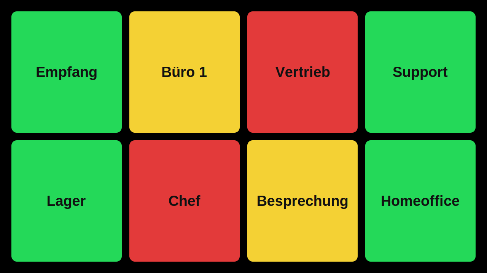

# DND Monitor für Snom D385

Der DND Monitor zeigt dir den Status deiner Snom-Telefone als große Kacheln im Browser an.
Gedacht ist das Ganze für ein Tablet oder einen Bildschirm im Büro (z. B. am Empfang).

- **Grün** = frei
- **Gelb** = im Gespräch
- **Rot** = DND aktiv



---

## Für wen ist diese Anleitung?

Für Leute, die Linux nur selten nutzen.  
Ich schreibe die Schritte deshalb extra einfach und ohne Abkürzungen.

---

## Voraussetzungen

- Ubuntu/Debian-Server oder Proxmox-Container
- Internetzugang auf dem Server
- Ein Benutzer mit `sudo`-Rechten (oder direkt `root`)

---

## Installation (Schritt für Schritt)

### 1) Als root anmelden

Wenn du nicht als root angemeldet bist:

```bash
sudo -i
```

### 2) Git installieren

```bash
apt update
apt install -y git
```

### 3) Projekt herunterladen

```bash
cd /opt
git clone https://github.com/dataklo/dnd-monitor.git dnd-monitor
cd dnd-monitor
```

### 4) Installation starten

```bash
./install.sh
```

Das Script installiert automatisch alles Nötige (Python, venv, Service usw.) und startet den Dienst.

### 5) Im Browser öffnen

```text
http://<SERVER-IP>:5000
```

Beispiel: `http://192.168.1.20:5000`

Zusätzlich läuft automatisch eine **Nur-Anzeige** auf Port `5001`:

```text
http://<SERVER-IP>:5001
```

Diese Ansicht ist für Kollegen gedacht: Status sehen ja, aber keine Schaltfunktionen.
Der Zugriff auf Port `5001` ist mit Benutzername/Passwort (HTTP Basic Auth) geschützt.
Die Zugangsdaten stehen auf dem Server in:

```text
/opt/dnd-monitor/config/readonly-auth.env
```

Beispiel zum Anzeigen der Zugangsdaten:

```bash
cat /opt/dnd-monitor/config/readonly-auth.env
```

Wichtig: Die Telefon-Events/API (`/status/...` und `/api/...`) bleiben auf `5001` ohne Login erreichbar,
damit externe Telefone (z. B. Homeoffice) weiterhin Events senden können.

---

## Namen der Telefone anzeigen (statt MAC)

Datei öffnen:

```bash
nano /opt/dnd-monitor/config/users.json
```

Beispielinhalt:

```json
{
  "users": {
    "00041393C660": {
      "name": "Empfang",
      "id": 1
    },
    "00041393C661": {
      "name": "Büro 1",
      "id": 2
    }
  }
}
```


Die `id` steuert die Reihenfolge im Raster:
- `1` = oben links (1. Zeile), `4` = oben rechts (bei 4 Spalten)
- `5` beginnt in der 2. Zeile links usw.
- Fehlt eine Zahl, wird einfach die nächste vorhandene Kachel angezeigt.

Unbekannte MAC-Adressen werden bei einem Event automatisch in `/opt/dnd-monitor/config/users.json` angelegt und erhalten die nächste freie `id` ab `101`.

Danach Dienst neu starten:

```bash
systemctl restart dnd-monitor
```

---

## Snom Action-URLs eintragen

Diese URLs müssen in die Snom-Konfiguration:

```xml
<action_dnd_on_url perm="R">http://<SERVER-IP>:5000/status/dnd-on?mac=$mac</action_dnd_on_url>
<action_dnd_off_url perm="R">http://<SERVER-IP>:5000/status/dnd-off?mac=$mac</action_dnd_off_url>
<action_connected_url perm="R">http://<SERVER-IP>:5000/status/connected?mac=$mac</action_connected_url>
<action_disconnected_url perm="R">http://<SERVER-IP>:5000/status/disconnected?mac=$mac</action_disconnected_url>
```

Bei jedem Event prüft der Monitor die Quell-IP zum Telefon (MAC → IP) und schreibt sie nur in `data/phones.json`, wenn sie sich geändert hat.

### DND per Klick auf Kachel auslösen

Wenn du im Dashboard auf den **Namen** einer Kachel tippst/klickst, ruft der Server am passenden Telefon auf:

```bash
curl --digest -u root:lbs2021 "http://<telefon-ip>/command.htm?key=DND"
```

Die `<telefon-ip>` kommt automatisch aus der zuletzt zur MAC gespeicherten Event-IP (DHCP-geeignet).

Vor dem Auslösen erscheint eine Sicherheitsabfrage (Bestätigen/Abbrechen).

Zum Schutz vor Mehrfachklicks gilt pro Telefon ein Cooldown von 5 Sekunden.

---

## Wichtige Befehle im Alltag

Status prüfen:

```bash
systemctl status dnd-monitor --no-pager
```

Neu starten:

```bash
systemctl restart dnd-monitor
```

Live-Log ansehen:

```bash
journalctl -u dnd-monitor -f
```

---

## Update durchführen

Wenn neue Versionen verfügbar sind:

```bash
cd /opt/dnd-monitor
./update.sh
```

Was passiert dabei?
- `git pull` lädt den neuesten Stand
- `install.sh` wird danach erneut ausgeführt
- Dienst wird mit der neuen Version gestartet

---

## Deinstallation

Wenn du das Projekt komplett entfernen willst:

```bash
cd /opt/dnd-monitor
./uninstall.sh
```

Das Script stoppt und entfernt den Service und löscht das Verzeichnis `/opt/dnd-monitor`.

---

## Tipp für Wand-Tablet / Daueranzeige

- Browser im Vollbild starten
- Auto-Sperre deaktivieren
- Seite als Startseite festlegen

Dann hast du eine saubere, dauerhafte Statusanzeige ohne Scrollen.
